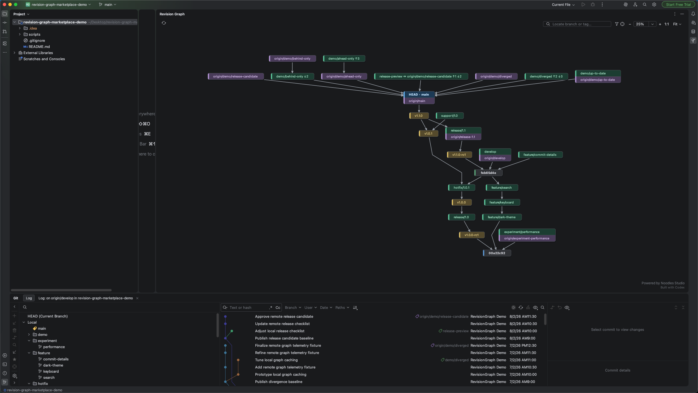
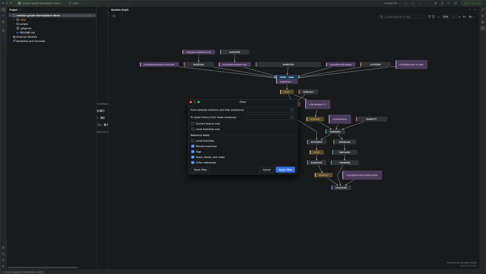
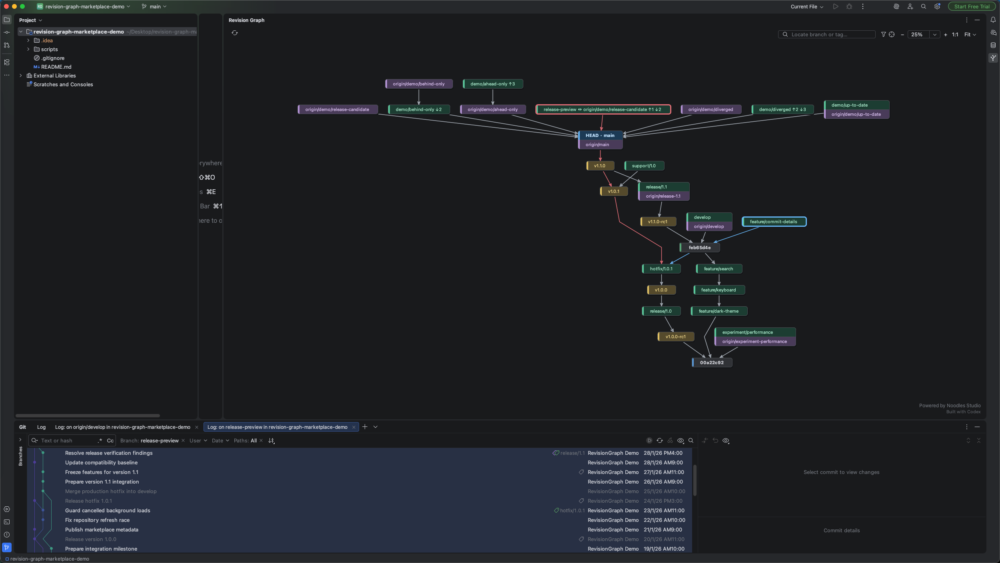

# RevisionGraph

[English](README.md) | 简体中文

[](LICENSE)
[](https://plugins.jetbrains.com/plugin/33494-revision-graph)

RevisionGraph 是一款原生 IntelliJ IDEA 插件，通过清晰、紧凑、可交互的图表展示 Git
关系，并将 Git 功能交互交给 IDE 内置的 Git4Idea。

## 功能演示

### 仓库拓扑

整体视图无需展开每一个提交，也能清晰展示长期分支、发布线、标签以及本地和远程引用。
本地分支标签会直接显示有意义的上游差异：同名 upstream 不重复显示，名称不同的跟踪关系
以及 Ahead/Behind 数量则保持可见。图表下方仍然可以使用 IntelliJ Git Log 查看详细提交历史。



### 历史和引用过滤

统一的过滤窗口将历史选择和引用显示控制集中在一个位置。可以按照修订范围、当前分支或
本地分支限制加载的图表，也可以独立显示或隐藏本地分支、远程分支、标签、特殊引用和其他
引用标签。隐藏某类引用只会改变标签，底层提交拓扑仍然保持可见。



### 修订关系

选择两个修订后，可以分别沿两侧路径回溯到共同可见祖先。两条路径使用与选中节点边框
相同的颜色，无需增加额外摘要面板也能直观看出分叉位置。选中的修订范围仍然可以通过
IntelliJ 原生 Git Log 和比较工作流进一步查看。



## 为什么使用 RevisionGraph？

大型仓库通常包含许多长期分支、远程引用、标签和合并路径。紧凑的提交时间线适合按照
时间顺序浏览历史，但当主要问题变成“这些分支之间是什么关系”时，往往不够直观。
RevisionGraph 专注于这种结构化视图。

它的分层 DAG 布局会减少连接线交叉，根据节点实际尺寸安排位置，并使用直线折线连接节点。
较短的侧分支会尽量靠近共同祖先，而不会被拉伸到整个画布的另一端。

## 功能特性

- 以紧凑的结构图展示本地分支、远程分支、标签、合并、HEAD 及其关系。
- 清晰展示包含多个引用的节点，保持标签易读，避免节点块过度膨胀。
- 直观显示 upstream 和 Ahead/Behind 状态，不重复展示多余的远程分支名称。
- 使用与选中节点一致的颜色高亮路径，展示两个修订如何从共同可见祖先分叉。
- 在同一个窗口中过滤历史和引用；隐藏标签不会移除底层提交拓扑。
- 提供搜索、HEAD 定位、平移、缩放和适应画布等大型仓库图表导航能力。
- Git 操作继续使用熟悉的 Git4Idea 工作流，并在仓库发生变化后自动更新图表。
- 支持英文和简体中文界面，并适配 IntelliJ 明亮和深色主题。

## 安装

### JetBrains Marketplace

可以从 [JetBrains Marketplace](https://plugins.jetbrains.com/plugin/33494-revision-graph)
安装 **Revision Graph**，也可以在 IntelliJ IDEA 的
**Settings | Plugins | Marketplace** 中搜索安装。

### 从源码构建

```bash
git clone https://github.com/noodles-studio/revision-graph.git
cd revision-graph
./gradlew test buildPlugin
```

可安装的插件压缩包会生成在 `build/distributions/` 目录下。在 IntelliJ IDEA 中打开
**Settings | Plugins**，选择 **Install Plugin from Disk**，然后选择生成的 ZIP 文件。

如果 JetBrains 下载服务不可用，可以使用本机已安装的兼容 IDE 进行构建：

```bash
./gradlew -PideaPath="/path/to/IntelliJ IDEA" test buildPlugin
```

## 使用方式

可以从 **Git** 菜单、项目右键菜单或
**View | Tool Windows | RevisionGraph** 打开 RevisionGraph。

- 单击节点进行选择，并在共用的 Git Log 标签页中显示对应历史。
- 按住 <kbd>Ctrl</kbd>/<kbd>Cmd</kbd> 再单击第二个节点，显示两个修订之间的关系路径。
- 右键单击一个节点，可以将其与工作区或 HEAD 比较、打开历史、切换到对应引用、创建分支
  或标签，或者复制引用名称。
- 右键单击双选节点，可以比较两个修订或打开对应的范围历史。
- 使用过滤窗口限制修订历史，或者独立隐藏不同类别的引用标签。
- 在画布空白区域拖动可以平移图表，使用鼠标滚轮或工具栏控制缩放。
- 使用准星按钮返回 HEAD，不会改变当前缩放比例或选中状态。
- 使用 **Fetch** 或按下 <kbd>F5</kbd>，调用 IntelliJ 项目级 Git Fetch。

## 工作原理

RevisionGraph 通过 IntelliJ IDEA 中配置的 Git 可执行程序读取带引用装饰的仓库拓扑。
图表使用 `git log --all --parents --simplify-by-decoration`，将历史简化为分支、标签、合并
和边界结构。

渲染流程使用 Kotlin 和 Java2D 实现：

1. 将 Git DAG 规范化为稳定、确定的拓扑顺序。
2. 计算成本最小化的层级分配。
3. 为跨越多个图层的连接插入虚拟节点。
4. 使用加权中值扫描减少连接线交叉。
5. 根据引用节点的实际尺寸压缩坐标。
6. 绘制直线折线路径，并在节点边界处进行裁切。

插件不包含 OGDF 原生库，也不需要 JNI 或 JNA 运行时。IDE 原生工作流通过 Git4Idea
调用，而不是由插件重新实现。

## 隐私

RevisionGraph 不包含数据分析、遥测、广告或自建网络服务。插件通过本地配置的 Git
可执行程序读取仓库历史。Fetch、比较、Git Log、检出或切换以及创建引用等操作，均由
IntelliJ 内置的 Git 集成功能处理。

## 开发

运行源码检查和单元测试：

```bash
./gradlew verifySourceStyle test
```

构建并验证插件：

```bash
./gradlew buildPlugin verifyPlugin
```

启动用于调试的 IntelliJ IDEA：

```bash
./gradlew runIde
```

欢迎提交问题和贡献代码。涉及 Git 解析、选择规则或图形布局的行为修改，应当添加针对性的
单元测试。

## 许可证与来源说明

RevisionGraph 是自由软件，采用
[GNU General Public License version 2 或更高版本](LICENSE)（`GPL-2.0-or-later`）。

本项目是一个独立的 Kotlin/JVM 实现，其用户交互和图形语义受到
[TortoiseGit RevisionGraph](https://github.com/TortoiseGit/TortoiseGit/tree/master/src/TortoiseProc/RevisionGraph)
启发。TortoiseGit 同样采用 GPL version 2 或更高版本许可证。更多署名和来源信息请参阅
[LICENSE-NOTICE.md](LICENSE-NOTICE.md)。

## 致谢

- TortoiseGit 和 TortoiseSVN 的贡献者，他们创造了最初的 RevisionGraph 使用体验。
- JetBrains 提供 IntelliJ Platform 和 Git4Idea 集成能力。
- 使用 OpenAI Codex 协助开发。
